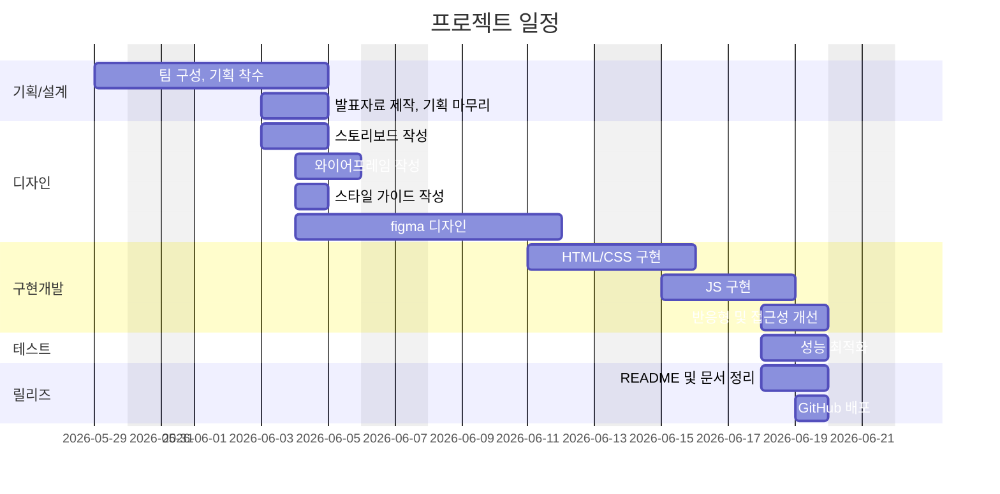

# 🕶️ ROUNZ 웹페이지 반응형 리뉴얼 프로젝트

<div align="center">
  
  
</div>

<br>

> **EST_fe_13_2st_project | 3조 O_O (오_오)**
> 안경 및 선글라스 온라인 쇼핑몰 **라운즈(ROUNZ)** 웹사이트를 모티브로 한 **반응형 웹 퍼블리싱 및 모듈형 웹 애플리케이션 리뉴얼 프로젝트**입니다. 
> 최신 웹 트렌드와 프리미엄 디자인 요소를 가미하여 고도화된 UI/UX로 재해석했습니다.

<br>

<div align="center">
  <a href="https://xoxoworld.github.io/EST_fe_13_2st_project/">
    
  </a>
  <a href="https://www.figma.com/design/2Vuv7WAMqIjzDzF3COCraq/O_O%EC%98%A4%EC%98%A4-3%ED%8C%80-%EB%94%94%EC%9E%90%EC%9D%B8?node-id=0-1&t=LelziT4F29Prhevt-1">
    
  </a>
  <a href="https://www.figma.com/slides/J0l34rO3Emojwpqs2F7Aoi">
    
  </a>
</div>

---

## 📅 프로젝트 정보
- **과정명** | 이스트캠프 오르미 프론트엔드 개발 13기 (React, HTML, CSS, JavaScript)
- **전체 기간** | 2026. 04. 07 ~ 2026. 08. 21
- **프로젝트 기간** | 2026. 05. 29 ~ 2026. 06. 19 (2차 프로젝트)

---

## 🌟 프로젝트 개요

- 📱 **반응형 웹 디자인**
  - 데스크톱, 태블릿, 모바일 기기 전체에서 매끄럽게 호환되는 HSL 기반 반응형 레이아웃 구현
- 🧩 **모듈화된 구조**
  - Vanilla CSS와 ES Modules(JavaScript)를 사용해 컴포넌트별 결합도와 가독성을 높인 독립적 파일 설계
- ⚙️ **검증된 UI/UX**
  - 슬라이더, 캐러셀, 동적 지점 검색 필터, 아코디언 메뉴, 가상 피팅 모의 CTA 등 실감형 인터랙션 제공

---

## 👥 팀원 소개

| 이름 | 역할 | 담당 브랜치 | GitHub |
| :---: | :--- | :---: | :---: |
| **정민** <br> *(팀장)* | 기획 / 디자인 / 로그인 / 회원가입 / 상품비교 퍼블리싱 | `jeongmin` | [@chittybb1357](https://github.com/chittybb1357-commits) |
| **성희** | 기획 / 디자인 / 메인 / 푸터 / 상품비교 퍼블리싱 | `sunghee` | [@xoxoworld](https://github.com/xoxoworld) |
| **시원** | 기획 / 디자인 / 상세 / 안경원 퍼블리싱 | `siwon` | [@isnow-x](https://github.com/isnow-x) |
| **소호** | 기획 / 디자인 / 메인 / 헤더 퍼블리싱 | `soho` | [@soho1109](https://github.com/soho1109) |
| **소영** | 기획 / 디자인 / 상품목록 / 장바구니 퍼블리싱 | `soyoung` | [@s0y0ungk](https://github.com/s0y0ungk) |

---

## 🗓️ 마일스톤 & 일정



<details>
<summary><b>📌 상세 마일스톤 접기/펼치기</b></summary>

#### 1일차 — 프로젝트 이해 & 환경 세팅
- [x] Rounz 기존 메인페이지 구조 분석 (레이아웃·UI/UX)
- [x] 피그마 또는 와이어프레임 제작
- [x] 필수 기능(비동기 데이터, 예외처리) 구현 범위 확정
- [x] GitHub 레포 생성 및 팀원 협업 환경 세팅
- [x] 폴더 구조 설계 (`/css`, `/scss`, `/js`, `/images` 등)

#### 2일차 — HTML 구조 설계 & 공통 요소 구현
- [x] HTML 시맨틱 구조 작성 (`header`, `nav`, `main`, `footer`)
- [x] 공통 헤더·푸터 마크업 및 스타일 작성
- [x] SCSS 변수·믹스인 정의 (색상, 폰트, 여백)
- [x] 기본 `reset.css` 또는 `normalize.css` 적용

#### 3일차 — 메인페이지 콘텐츠 구현
- [x] Hero 배너, 추천 상품, 이벤트 영역 마크업
- [x] SASS로 반응형 그리드/레이아웃 적용
- [x] JavaScript로 첫 번째 비동기 데이터 렌더링 구현 (예: 상품 목록)
- [x] 예외처리 기본 로직 추가 (데이터 불러오기 실패 시 메시지 출력)

#### 4일차 — 서브페이지별 기능 개발 & 데이터 연동
- [x] 팀원별 담당 서브페이지 HTML/CSS 작성
- [x] 데이터 필터링·정렬 기능 추가
- [x] 예외처리 고도화 (네트워크 오류, 빈 데이터 처리)
- [x] GitHub에 각자 브랜치 병합 전 PR 생성

#### 5일차 — 통합, 버그 수정 & 배포 준비
- [x] 메인 + 서브페이지 통합
- [x] 반응형 디테일 조정 (모바일·태블릿·데스크탑)
- [x] 크로스 브라우저 테스트 (Chrome, Edge, Safari)
- [x] GitHub Pages 배포 설정
- [x] 배포 후 URL 공유

#### 6일차 — 최종 점검 & 발표 자료 완성
- [x] 배포 사이트 기능 최종 점검
- [x] 모든 코드·주석 정리
- [x] 발표 자료 (슬라이드, 시연 영상) 완성
- [x] 팀원별 발표 파트 확정
</details>

---

## 🚀 핵심 기능 (Key Features)

### 1. 메인 매거진 & 브랜드 추천 (`index.html`)
- 📖 **STYLE MAGAZINE**: 트렌디한 카드 형태 그리드로 썸네일 호버 시 줌인(Zoom-in) 애니메이션 제공
- 🛍️ **NEW PRODUCT**: 브랜드 필터 칩을 클릭해 동적으로 상품 탐색 가능, 데스크톱/모바일별 가로 슬라이더 및 네비게이션 닷츠(Dots) 자동 조절
- 🕶️ **AI CTA**: 스마트 가상 피팅 예약 유도 배너 탑재
- 📱 **ABOUT US**: 모바일 전용 수평 스크롤링 및 진행 상태 바(Scroll Progress Bar) 연동
- 📍 **ROUNZ STORE**: 지역(시/도, 시/군/구) 필터링 UI 및 방문 예약/전화 걸기 다이렉트 액션 연동

### 2. 모델 비교하기 (`compare.html`)
- ⚖️ **아이웨어 모델 다중 비교**: 3개 열(Column)에 브랜드별 셀렉트 박스와 제품 상세 카드 표출
- 📌 **직관적 핀아웃**: 구입하기 및 더 알아보기 액션과 가상피팅/얼굴분석 부가 기능 연계

### 3. 서브 페이지 및 기타 기능
- 🔍 **상품 목록 및 상세 (`productList.html`, `product.html`)**: 동적 목록화 및 아이웨어 상세 정보 구조 설계
- 🛒 **장바구니 (`cart.html`)**: 반응형 상품 체크 및 실시간 가격 집계 처리
- 🔑 **회원 인증 (`login.html`, `signup.html`)**: 모던한 폼 필드와 클라이언트 사이드 유효성 검증 레이아웃

---

## 🛠️ 기술 스택 (Tech Stack)

### **Core**
- **HTML5**: 시맨틱 웹 표준 준수, SEO 및 접근성 향상, 이미지 지연 로딩(`loading="lazy"`) 적용
- **Vanilla CSS**: CSS Custom Properties(변수) 기반의 디자인 시스템화 (`common.css`)
  - HSL 컬러 시스템, 일관된 타이포그래피 스케일, 테마 관리
  - 미디어 쿼리 분기(`1024px` / `768px` / `480px`)를 통한 멀티 디바이스 반응형 레이아웃 최적화
- **JavaScript (ES6+)**: ES Modules 방식을 적용하여 페이지 단위 스크립트 모듈 분리 (`js/pages/`, `js/modules/`)

### **Data & Assets**
- **JSON Data**: 모의 API를 위한 상품 리스트(`products.json`) 및 라운즈 안경원 리스트(`stores.json`) 탑재
- **Web Fonts & Vector**: `Inter`, `Outfit`, `Noto Sans KR` 웹 서체 적용 및 인라인 SVG 최적화

---

## 📂 디렉토리 구조 (Directory Structure)

<details>
<summary><b>📂 전체 디렉토리 트리 보기</b></summary>

```bash
EST_fe_13_2st_project
├── .husky/                    # Git Hooks 설정 (pre-commit 등)
├── .vscode/                   # VSCode 프로젝트 공유 설정
├── assets/                    # 정적 리소스 (icons, images, video)
├── css/                       # 페이지별 CSS 및 공통 유틸리티 스타일
├── data/                      # 모의 데이터 (products.json, stores.json)
├── html/                      # 서브페이지 HTML
├── js/                        # Vanilla JS 모듈 및 페이지별 스크립트
│   ├── modules/               # 공통 컴포넌트 모듈 (header, footer 등)
│   ├── pages/                 # 각 페이지별 기능 구현 JS
│   ├── common.js              # 공통 유틸리티 기능
│   └── main.js                # index 페이지 기능
├── scss/                      # SCSS 소스 파일
├── .gitignore                 # Git 관리 예외 파일 정의
├── index.html                 # 프로젝트 메인 페이지
├── package-lock.json          # 의존성 잠금 파일
└── package.json               # 의존성 패키지 및 스크립트 정의 파일
```
</details>

---

## ⚡ 주요 최적화 내역 (Optimizations)

- 🔒 **미디어 쿼리 스코프 격리**
  - 기존 `@media (width <= 768px)` 내부 괄호 누락 버그를 완벽히 해결하여 데스크톱 해상도(`> 768px`)에서 메인 영역 하위 레이아웃이 깨지던 현상을 방지했습니다.
- 🔗 **페이지 간 흐름 연계 (UX 고도화)**
  - 헤더 로고, 로그인, 장바구니, 푸터 매장 링크 등 주요 페이지 간 경로를 유기적으로 연결하여 사용자 이탈을 최소화했습니다.
- ⚡ **이미지 렌더링 최적화**
  - 스크롤 아래 영역에 존재하는 무거운 배너 이미지 및 상품 썸네일 카드에 `loading="lazy"` 속성을 적용하여 초기 로딩 속도(LCP)를 대폭 개선했습니다.

---

## 💻 로컬 구동 방법

**1. 리포지토리 클론**
```bash
git clone https://github.com/xoxoworld/EST_fe_13_2st_project.git
```

**2. 프로젝트 실행**
- 로컬 폴더 내의 `index.html` 파일을 브라우저로 직접 실행하거나,
- VS Code에서 **Live Server** 익스텐션을 활성화하여 로컬 호스트(`http://localhost:5500`) 환경에서 실시간 렌더링을 확인하며 테스트할 수 있습니다.

---

## 🔮 향후 개선 사항
- [ ] **성능 극대화**: 고화질 안경 이미지를 WebP 포맷으로 변환하고 반응형 이미지를 적용해 로딩 속도 추가 개선
- [ ] **사용자 경험(UX) 확장**: 추가적인 서브 페이지 및 동적 인터랙션 개발
- [ ] **데이터 관리 고도화**: 정적 JSON 파일 기반에서 REST API 비동기 통신 구조로 점진적 전환
- [ ] **유지보수성 향상**: 결합도가 높은 스크립트의 의존성을 정리하고 공통 모듈화 강화

---

## 📝 제작 후기
*(팀원들의 소감이나 제작 후기를 기록해 보세요!)*