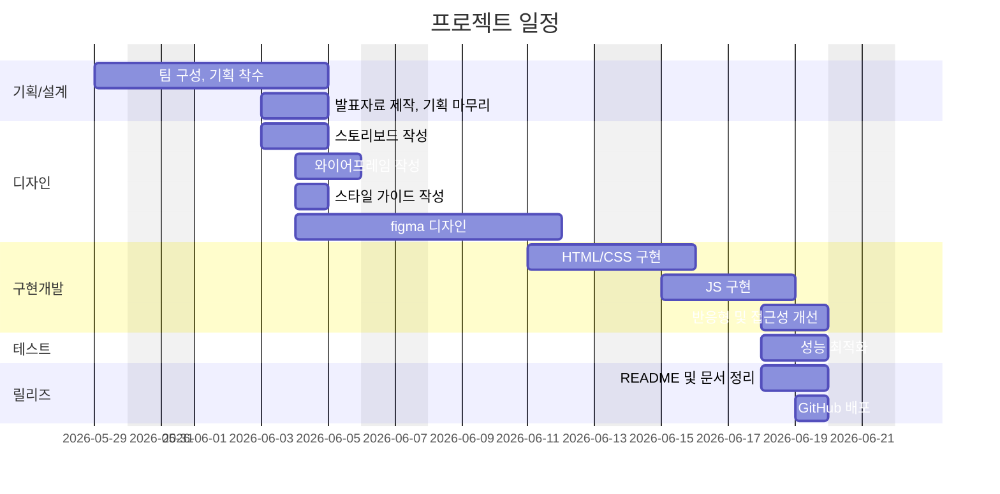

# 🕶️ ROUNZ 웹페이지 반응형 리뉴얼 프로젝트 (EST_fe_13_2st_project)

## 3조 O_O

+ 과정명 : 이스트캠프 오르미 프론트엔드 개발 13기(React, HTML, CSS, JavaScript)
+ 기간: 2026/04/07 ~ 2026/08/21
+ 2차 프로젝트 : 2026/05/29 ~ 2026/06/19

---

## 🌟 프로젝트 개요

이 프로젝트는 이스트소프트 프론트엔드 개발자 오르미캠프 13기 2차 프로젝트로, 안경 및 선글라스 온라인 쇼핑몰 **라운즈(ROUNZ)** 웹사이트를 모티브로 삼아, 최신 웹 트렌드와 프리미엄 디자인 요소를 가미한 **반응형 웹 퍼블리싱 및 모듈형 웹 애플리케이션 리뉴얼 프로젝트**입니다.

안경을 사고 쓰는 즐거운 경험을 제공하는 **라운즈(ROUNZ)** 쇼핑몰을 고도화된 UI/UX로 재해석했습니다.

- **반응형 웹 디자인**: 데스크톱, 태블릿, 모바일 기기 전체에서 매끄럽게 호환되는 HSL 기반 반응형 레이아웃 구현
- **모듈화된 구조**: Vanilla CSS와 ES Modules(JavaScript)를 사용해 컴포넌트별 결합도와 가독성을 높인 독립적 파일 설계
- **검증된 UI/UX**: 슬라이더, 캐러셀, 동적 지점 검색 필터, 아코디언 메뉴, 가상 피팅 모의 CTA 등 실감형 모바일-데스크톱 인터랙션 제공

---

## 👥 팀원 

| 이름     | 역할                                                    | 담당 브랜치 | GitHub 링크                                                      |
| :------- | :------------------------------------------------------ | :---------- | :--------------------------------------------------------------- |
| **정민** | 👑 팀장 / 기획/디자인/로그인/회원가입/상품비교 퍼블리싱 | `jeongmin`  | [@chittybb1357-commits](https://github.com/chittybb1357-commits) |
| **성희** | 💻 팀원 / 기획/디자인/메인/푸터/상품비교 퍼블리싱       | `sunghee`   | [@xoxoworld](https://github.com/xoxoworld)                       |
| **시원** | 💻 팀원 / 기획/디자인/상세/안경원 퍼블리싱              | `siwon`     | [@isnow-x](https://github.com/isnow-x)                           |
| **소호** | 💻 팀원 / 기획/디자인/메인/헤더 퍼블리싱                | `soho`      | [@soho1109](https://github.com/soho1109)                         |
| **소영** | 💻 팀원 / 기획/디자인/상품목록/장바구니 퍼블리싱        | `soyoung`   | [@s0y0ungk](https://github.com/s0y0ungk)                         |

---

## 🗓️ 마일스톤



## 🚀 핵심 기능 (Key Features)

### 1. 메인 매거진 & 브랜드 추천 (`index.html`)

- **STYLE MAGAZINE**: 트렌디한 카드 형태 그리드로 썸네일 호버 시 줌인(Zoom-in) 애니메이션 제공
- **NEW PRODUCT**: 브랜드 필터 칩을 클릭해 동적으로 상품 탐색 가능, 데스크톱/모바일별 가로 슬라이더 및 네비게이션 닷츠(Dots) 자동 조절
- **AI CTA**: 스마트 가상 피팅 예약 유도 배너 탑재
- **ABOUT US**: 모바일 전용 수평 스크롤링 및 **진행 상태 바(Scroll Progress Bar)** 연동
- **ROUNZ STORE**: 지역(시/도, 시/군/구) 필터링 UI 및 방문 예약/전화 걸기 다이렉트 액션 연동

### 2. 모델 비교하기 (`compare.html`)

- **아이웨어 모델 다중 비교**: 3개 열(Column)에 브랜드별 셀렉트 박스와 제품 상세 카드 표출
- **직관적 핀아웃**: 구입하기 및 더 알아보기 액션과 가상피팅/얼굴분석 부가 기능 연계

### 3. 유저 인터페이스 & 기타 페이지

- **상품 목록 및 상세 (`productList.html`, `product.html`)**: 동적 목록화 및 아이웨어 상세 정보 상세 설계
- **장바구니 (`cart.html`)**: 반응형 상품 체크, 가격 집계 처리
- **회원 인증 (`login.html`, `signup.html`)**: 모던한 폼 필드와 유효성 검증 레이아웃

---

## 🛠️ 기술 스택 (Tech Stack)

### **Core**

- **HTML5**: 시맨틱 웹 및 SEO 접근성 향상, 이미지 지연 로딩(`loading="lazy"`) 적용
- **Vanilla CSS**: CSS Custom Properties(변수) 기반의 디자인 시스템화 (`common.css`)
  - 일관된 컬러 토큰, 미세 타이포그래피, 디자인 테마 관리
  - 미디어 쿼리 분기(`1024px` / `768px` / `480px`)를 통한 멀티 디바이스 레이아웃 최적화
- **JavaScript (ES6+)**: ES Modules 방식을 적용하여 페이지 단위 스크립트 모듈 분리 (`js/pages/`, `js/modules/`)

### **Data & Assets**

- **JSON 데이터**: 모의 API용 상품 리스트(`products.json`) 및 라운즈 안경원 리스트(`stores.json`) 탑재
- **Google Fonts & SVG**: 'Inter', 'Outfit', 'Noto Sans KR' 서체 적용 및 인라인/벡터 벡터 그래픽 최적화


## 배포 URL

+ [Git](https://xoxoworld.github.io/EST_fe_13_2st_project/)

---

## 📂 디렉토리 구조 (Directory Structure)

```bash
EST_fe_13_2st_project
├── .husky/                    # Git Hooks 설정
│   └── pre-commit             # 커밋 전 실행 스크립트
│
├── .vscode/
│   └── settings.json          # VSCode 프로젝트 설정
│
├── assets/                    # 정적 리소스
│   ├── icons/                 # 아이콘 파일
│   ├── images/                # 이미지 파일
│   └── video/                 # 영상 파일
│
├── css/
│   ├── cart.css               # 장바구니 페이지 스타일
│   ├── common.css             # 공통 디자인 스타일
│   ├── compare.css            # 모델 비교 페이지 스타일
│   ├── compare.css.map        # 모델 비교 페이지 map 파일
│   ├── flex-utility.css       # 공통 Flex 유틸리티 스타일
│   ├── index.css              # 메인 페이지 스타일
│   ├── login.css              # 로그인 페이지 스타일
│   ├── normalize.css          # 브라우저 스타일 정규화
│   ├── product.css            # 상품 상세 페이지 스타일
│   ├── productList.css        # 상품 목록 페이지 스타일
│   ├── reset.css              # 기본 스타일 초기화
│   ├── sign.css               # 회원가입 관련 공통 스타일
│   ├── signup.css             # 회원가입 페이지 스타일
│   └── stores.css             # 안경원 페이지 스타일
│
├── data/
│   ├── products.json          # 상품 데이터
│   └── stores.json            # 안경원 데이터
│
├── html/
│   ├── cart.html              # 장바구니 페이지
│   ├── common.html            # 공통 컴포넌트 테스트 페이지
│   ├── compare.html           # 모델 비교 페이지
│   ├── login.html             # 로그인 페이지
│   ├── product.html           # 상품 상세 페이지
│   ├── productList.html       # 상품 목록 페이지
│   ├── signup.html            # 회원가입 페이지
│   └── stores.html            # 매장 찾기 페이지
│
├── js/
│   ├── modules/               # 공통 모듈
│   │   ├── footer.js          # Footer 컴포넌트
│   │   ├── header.js          # Header 컴포넌트
│   │   └── menuToggle.js      # 모바일 메뉴 토글
│   │
│   ├── pages/                 # 페이지별 js
│   │   ├── cart.js            # 장바구니 기능
│   │   ├── compare.js         # 모델 비교 기능
│   │   ├── login.js           # 로그인 기능
│   │   ├── product.js         # 상품 상세 기능
│   │   ├── productList.js     # 상품 목록 기능
│   │   ├── signup.js          # 회원가입 기능
│   │   └── stores.js          # 매장 찾기 기능
│   │
│   ├── common.js              # 공통 유틸리티 기능
│   └── main.js                # index 페이지 기능
│
├── scss/                      # SCSS 소스 파일
│
├── .gitignore                 # Git 추적 예외 파일 정의
├── index.html                 # 프로젝트 메인 페이지
├── package-lock.json          # 의존성 잠금 파일
├── package.json               # 의존성 패키지 및 스크립트 정의 파일
└── README.md                  # 프로젝트 readme 문서
```

---

## ⚡ 주요 최적화 내역 (Optimizations)

1. **미디어 쿼리 스코프 격리**:
   - 기존의 `@media (width <= 768px)` 내부 괄호 누락 버그를 완벽히 해결하여, 데스크톱 해상도(`> 768px`)에서 메인 영역 하위 레이아웃이 유실되거나 깨지는 문제를 근본적으로 해결했습니다.
2. **페이지 간 흐름 연계 (UX 고도화)**:
   - 헤더의 로고(`index.html`), 로그인(`login.html`), 장바구니(`cart.html`), 푸터의 플래그십 스토어/파트너 안경원(`stores.html`) 링크를 올바르게 연결하여 유저 탐색 편의성을 높였습니다.
3. **이미지 렌더링 최적화**:
   - 뷰포트 아래 영역에 존재하는 무거운 배너 이미지 및 상품 썸네일 카드에 `loading="lazy"` 속성을 적용하여 LCP(Largest Contentful Paint) 속도를 획기적으로 개선했습니다.

## 향후 개선 사항


## 제작 후기

---

## 기획 / 디자인 문서
- **기획서(피그마 슬라이드)**: 와이어프레임 및 스토리보드, 화면 흐름, 컨셉, 요구사항, 마일스톤 정리 
  링크: https://www.figma.com/slides/J0l34rO3Emojwpqs2F7Aoi
- **디자인 원본(피그마)**: 컴포넌트, 컬러/타이포 스케일, 반응형 레이아웃, 아이콘 
  링크: https://www.figma.com/design/2Vuv7WAMqIjzDzF3COCraq/O_O%EC%98%A4%EC%98%A4-3%ED%8C%80-%EB%94%94%EC%9E%90%EC%9D%B8?node-id=0-1&t=LelziT4F29Prhevt-1